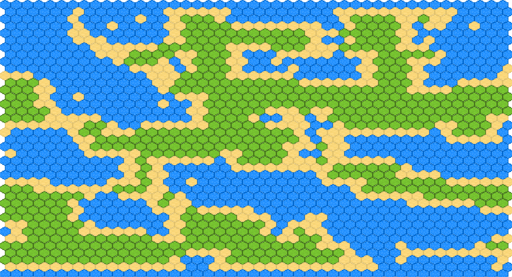

procsland
===========
A cellular automata based procedural hex island map generator.

## Usage
```
main.rkt [ <option> ... ]
  procsland is an hex map island generator
  based on cellular automata.
 where <option> is one of
  -W <SCREEN-WIDTH>, --screen-width <SCREEN-WIDTH> : width of the screen in pixels
  -H <SCREEN-HEIGHT>, --screen-height <SCREEN-HEIGHT> : height of the screen in pixels
  -s <MAP-SIZE>, --map-size <MAP-SIZE> : size of the map in (hex) tiles
  -l <LAND-MASS>, --land-mass <LAND-MASS> : probability for land tiles to appear
  -i <ITERATIONS>, --iterations <ITERATIONS> : number of iterations of the cellular automata to perform
  --help, -h : Show this help
  -- : Do not treat any remaining argument as a switch (at this level)
 Multiple single-letter switches can be combined after one `-'; for
  example: `-h-' is the same as `-h --'
```
## Screenshot



Tileset is a combination (and scaling) of [Basic Hex Tile Set - 16x16 by Dr. Jamgo](https://opengameart.org/content/basic-hex-tile-set-16x16) and [Basic Hex Tile Set Plus - 16x16 by pistachio](https://opengameart.org/content/basic-hex-tile-set-plus-16x16).
